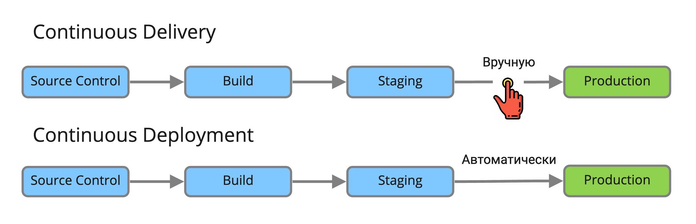

## CI / CD

1. What is the difference Continuous Integration от Continuous Delivery and Continuous Deployment?

  
Answer

Continuous Integration - the practice of integrating code changes from a development branch into the main branch using integration tools.

Continuous Delivery - the practice of keeping code in a repository in a state suitable for deployment to a production environment.

Continuous Deployment - the practice of delivering every change in the product code to the production environment.

The difference between Continuous Delivery and Continuous Deployment is very small. Let's imagine two pipelines for the same application. Each has the following steps:

1. Source Control - making changes to the software version control system.
2. Build - building the application and running unit tests
3. Staging - deploy to a test environment, run integration, load and other tests
4. Production - deploy to environment with users

Each pipeline is launched automatically by a trigger from the version control system. In the case of Continuous Deployment, each subsequent step will be executed automatically if the previous one was successful, including deployment to Production.

If you have Continuous Delivery, the steps will be performed automatically only in a secure environment, and before deploying to Production, the pipeline will stop and wait for manual confirmation. The mechanism for how this will be implemented can be different. From the simplest, when the responsible person must go to the pipeline and click the Next button, to an interactive bot with buttons in a corporate messenger.

2. What does mean? `when: always` in stage code block in gitlab CI?

  
Answer

This construction means that the stage will be launched regardless of the success of the previous step.

3. What does the `extends: .plan` do in gitlab CI?

  
Answer

`extends` is used to reuse a section of a pipeline (analogous to a function). `.plan` points to the name of the section in the pipeline to be repeated. The script from `extends` is executed first in the step.

4. In gitlab CI it is necessary that the job is always executed only with manual activation. What should be done for this?

  
Answer

You need to add `when: manual` to the description of the given job. By default, when using `when: manual`, the `allow_failure` parameter is set to `true`, so this job will be launched automatically. To avoid this, you also need to set the `allow_failure: false` parameter.

