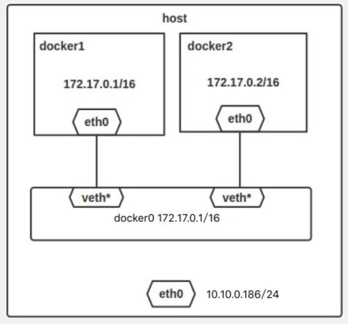

## Docker

1. What is Docker? What is the difference between a container and an image?

<details>
  <summary>Answer</summary>

Docker is a software for automating the deployment and management of applications in container-enabled environments.

An image is an application template that contains file system layers in read-only mode.

A container is a running application image that, in addition to the lower layers in read-only mode, contains an upper layer in read-write mode.

</details>

2. What instructions does a Dockerfile have?
<details>
  <summary>Answer</summary>

| Instruction | Description |
|------------|--------------------------------------------------------------------------------------------------------------------------------------------------------------------------------------------------------------|
| FROM | Specifies the base (parent) image. |
| LABEL | Describes metadata. For example, information about who created and maintains the image. |
| ENV | Sets persistent environment variables. |
| RUN | Executes a command and creates an image layer. Used to install packages into a container. |
| COPY | Copies files and directories to the container. |
| ADD | Copies files and directories to a container, can unpack local .tar files. |
| CMD | Describes a command with arguments to be executed when the container is started. Arguments can be overridden when the container is started. Only one CMD instruction can be present in the file. |
| WORKDIR | Specifies the working directory for the next instruction. |
| ARG | Specifies variables to pass to Docker when building an image. |
| ENTRYPOINT | Provides a command with arguments to be called during container execution. Arguments are not overridden. |
| EXPOSE | Indicates the need to open a port. |
| VOLUME | Creates a mount point for working with persistent storage. |

</details>

3. What is the difference between *CMD* and *ENTRYPOINT* in Dockerfile?

<details>
  <summary>Answer</summary>

The CMD and ENTRYPOINT instructions are executed when the container is launched, only the CMD instruction allows you to override the arguments passed to the command.

**Пример 1. CMD:**
Let's describe the image assembly in Dockerfile.
```
FROM alpine  
CMD ["ping", "8.8.8.8"]  
```
The CMD instruction is passed 2 arguments. Let's build the image `docker build -t test .` and run the container.
```
$ docker run test
PING 8.8.8.8 (8.8.8.8): 56 data bytes
64 bytes from 8.8.8.8: seq=0 ttl=43 time=32.976 ms
64 bytes from 8.8.8.8: seq=1 ttl=43 time=31.998 ms
64 bytes from 8.8.8.8: seq=2 ttl=43 time=31.843 ms
--- 8.8.8.8 ping statistics ---
3 packets transmitted, 3 packets received, 0% packet loss
round-trip min/avg/max = 31.708/33.316/36.823 ms
```
Now let's pass 2 new arguments to start the container.
```
$ docker run test traceroute 1.1.1.1
traceroute to 1.1.1.1 (1.1.1.1), 30 hops max, 46 byte packets
 1  172.17.0.1 (172.17.0.1)  0.017 ms  0.016 ms  0.009 ms
 2  192.168.168.1 (192.168.168.1)  0.996 ms  1.553 ms  2.069 ms
 3  *  *  *
 4  lag-2-435.bgw01.samara.ertelecom.ru (85.113.62.125)  1.454 ms  1.427 ms  1.984 ms
 5  172.68.8.3 (172.68.8.3)  19.685 ms  15.722 ms  15.565 ms
 6  172.68.8.2 (172.68.8.2)  15.846 ms  22.696 ms  35.093 ms
 7  one.one.one.one (1.1.1.1)  17.439 ms  17.670 ms  24.202 ms
```
`ping` replaced by traceroute, IP address replaced by 1.1.1.1.

**Пример 2. ENTRYPOINT:**
Let's describe the image assembly in Dockerfile.
```
FROM alpine  
ENTRYPOINT ["ping", "8.8.8.8"]
```
The ENTRYPOINT instruction takes 2 arguments. Let's build the image `docker build -t test .` and run the container.
```
$ docker run test2
PING 8.8.8.8 (8.8.8.8): 56 data bytes
64 bytes from 8.8.8.8: seq=0 ttl=43 time=36.189 ms
64 bytes from 8.8.8.8: seq=1 ttl=43 time=44.120 ms
64 bytes from 8.8.8.8: seq=2 ttl=43 time=44.584 ms
^C
--- 8.8.8.8 ping statistics ---
3 packets transmitted, 3 packets received, 0% packet loss
round-trip min/avg/max = 36.189/41.631/44.584 ms
```
Now let's pass a change to one of the arguments to start the container.
```
$ docker run test2 ping 1.1.1.1
BusyBox v1.31.1 () multi-call binary.

Usage: ping [OPTIONS] HOST

Send ICMP ECHO_REQUEST packets to network hosts

	-4,-6		Force IP or IPv6 name resolution
	-c CNT		Send only CNT pings
	-s SIZE		Send SIZE data bytes in packets (default 56)
	-i SECS		Interval
	-A		Ping as soon as reply is recevied
	-t TTL		Set TTL
	-I IFACE/IP	Source interface or IP address
	-W SEC		Seconds to wait for the first response (default 10)
			(after all -c CNT packets are sent)
	-w SEC		Seconds until ping exits (default:infinite)
			(can exit earlier with -c CNT)
	-q		Quiet, only display output at start
			and when finished
	-p HEXBYTE	Pattern to use for payload
```
As we can see, it is not possible to pass an argument to the container.

**Пример 3. ENTRYPOINT и CMD:**
Let's describe the image assembly in Dockerfile.
```
FROM alpine  
ENTRYPOINT ["ping"]
CMD ["8.8.8.8"]
```
The ENTRYPOINT instruction is passed the `ping` argument, the CMD is passed the 8.8.8.8 argument. Let's build the image `docker build -t test .` and run the container.
```
$ docker run test3
PING 8.8.8.8 (8.8.8.8): 56 data bytes
64 bytes from 8.8.8.8: seq=0 ttl=43 time=41.176 ms
64 bytes from 8.8.8.8: seq=1 ttl=43 time=32.875 ms
64 bytes from 8.8.8.8: seq=2 ttl=43 time=40.395 ms
^C
--- 8.8.8.8 ping statistics ---
3 packets transmitted, 3 packets received, 0% packet loss
round-trip min/avg/max = 32.875/38.148/41.176 ms
```
Let's try changing 2 arguments.
```
$ docker run test3 traceroute 1.1.1.1
BusyBox v1.31.1 () multi-call binary.

Usage: ping [OPTIONS] HOST

Send ICMP ECHO_REQUEST packets to network hosts

	-4,-6		Force IP or IPv6 name resolution
	-c CNT		Send only CNT pings
	-s SIZE		Send SIZE data bytes in packets (default 56)
	-i SECS		Interval
	-A		Ping as soon as reply is recevied
	-t TTL		Set TTL
	-I IFACE/IP	Source interface or IP address
	-W SEC		Seconds to wait for the first response (default 10)
			(after all -c CNT packets are sent)
	-w SEC		Seconds until ping exits (default:infinite)
			(can exit earlier with -c CNT)
	-q		Quiet, only display output at start
			and when finished
	-p HEXBYTE	Pattern to use for payload
```
It is impossible to change 2 arguments. Let's replace the argument of the CMD instruction.
```
$ docker run test3 1.1.1.1    
PING 1.1.1.1 (1.1.1.1): 56 data bytes
64 bytes from 1.1.1.1: seq=0 ttl=58 time=31.412 ms
64 bytes from 1.1.1.1: seq=1 ttl=58 time=19.400 ms
64 bytes from 1.1.1.1: seq=2 ttl=58 time=15.814 ms
^C
--- 1.1.1.1 ping statistics ---
3 packets transmitted, 3 packets received, 0% packet loss
round-trip min/avg/max = 15.814/22.208/31.412 ms
```
With this image build, the ENTRYPOINT and CMD commands will be run sequentially when the container is launched, but the argument can only be changed for CMD.

</details>

4. What is the difference between *COPY* and *ADD* in Dockerfile?

<details>
  <summary>Answer</summary>

The *COPY* instruction copies files and directories from the host machine into the container, the *ADD* instruction copies files and directories from the host machine into the container and can unpack .tar archives.

</details>

5. What are the best practices for writing Dockerfile?

<details>
  <summary>Answer</summary>

1. Run only one process per container.
2. Try to combine several RUN commands into one to reduce the number of image layers.
3. Frequently changed layers of the image should be placed lower in the level to speed up the assembly process, since when the top layer is changed, all the following layers will be reassembled.
4. Specify explicit image versions in the FROM statement to avoid the case where a new version of an image is released with the latest tag.
5. When installing packages, specify the package versions.
6. Clear the package manager cache and delete unnecessary files after the instructions are executed.
7. Use multistage build to build an artifact in one container and place it in another.

</details>

6. What types of network drivers are used in docker?

<details>
  <summary>Answer</summary>

Main docker network drivers: bridge, host, overlay, ipvlan, macvlan, none

**bridge:** эthen the default network driver. Bridge networking is used when your applications run in standalone containers that need to communicate with each other.

The interaction with the host is done via the docker0 bridge and the iptables nat table configuration. In this mode, a network namespace will be allocated, an IP address will be set for each container, and the Docker container on the host will be connected to the virtual bridge. The virtual bridge acts as a physical switch, so all containers on the host are connected to the layer 2 network through the switch.

**host:** uses the host network directly without isolating the container and host.

**none:** This mode puts the container in its own network stack, but does not perform any configuration. In fact, this mode disables the container's networking feature, which is useful in the following two situations: The container does not require networking (for example, only for a batch task to write disk volumes).

**macvlan:** In Macvlan Bridge mode, each container has a unique MAC address that is used to track the MAC address-to-port mapping of the Docker host. The Macvlan driver network is connected to the parent interface of the Docker host. Examples are physical interfaces such as eth0, the eth0.10 subinterface for 802.1q VLAN tagging (.10 means VLAN 10), or even a bonded host adapter that combines two Ethernet interfaces into a single logical interface. The designated gateway is external to the host, provided by the network infrastructure. Each Docker network in Macvlan Bridge mode is isolated from each other, and only one network can be connected to the parent node at a time. Each host adapter has a theoretical limit, and each host adapter can connect to a Docker network. Any container on the same subnet can communicate with any other container on the same network without a macvlan bridge gateway. The same docker networking command applies to the vlan driver. In Macvlan mode, without external process routing between two networks/subnets, containers on different networks cannot access each other. This also applies to multiple subnets on the same terminal network.

**overlay:** Overlay networks connect multiple Docker daemons together and allow swarm services to communicate with each other. You can also use overlay networks to facilitate communication between a swarm service and a standalone container, or between two standalone containers in different Docker daemons. This strategy eliminates the need to perform OS-level routing between these containers.

**ipvlan:** IPvlan networks provide users with complete control over IPv4 and IPv6 addressing. The VLAN driver builds on this capability, giving operators complete control over Layer 2 VLAN tagging and even IPvlan L3 routing for users.

</details>

7. What are ephemeral containers?

<details>
  <summary>Answer</summary>

[Ephemeral containers](https://kubernetes.io/docs/concepts/workloads/pods/ephemeral-containers/) became a beta feature in Kubernetes v1.23 and are now enabled by default.
Ephemeral containers are intended for transient tasks where you need to temporarily [attach an additional container to an existing pod](https://kubernetes.io/docs/tasks/debug/debug-application/debug-running-pod/#ephemeral-container). This is ideal for debugging operations where you want to inspect pods without affecting live container instances.

</details>